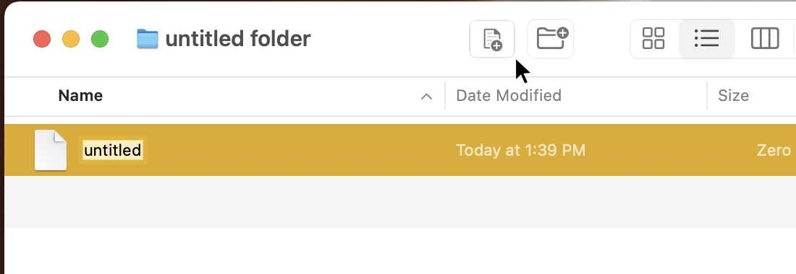

# New File Finder Button

- This script/applet only works with my [New File _Finder Style_ Alfred Workflow](https://github.com/CiiDub/new_file_finder_style)
- I used a personal and finicky BBEdit package to build the script.
	- This BBPackage uses the commands: __osacompile__, __sips__ & __iconutil__ to do it’s work.
	- I will liking post it someday.
- The icon is styled with the assumption that ‘System Preferences > Accessibility > Display > Show window title icons’ is on. It is made to match a recent version of macOS.
- I totally eyeballed that icon, so it probably doesn’t line up perfectly. _*It’s pretty damn close_.
- Here is the little applet for download: [new_file_button.tar.gz](https://github.com/CiiDub/new_file_finder_button/raw/main/build/new_text_file.app.tar.gz)
- Add it to the finder toolbar by holding __⌘__ and dragging the applet to the toolbar.

